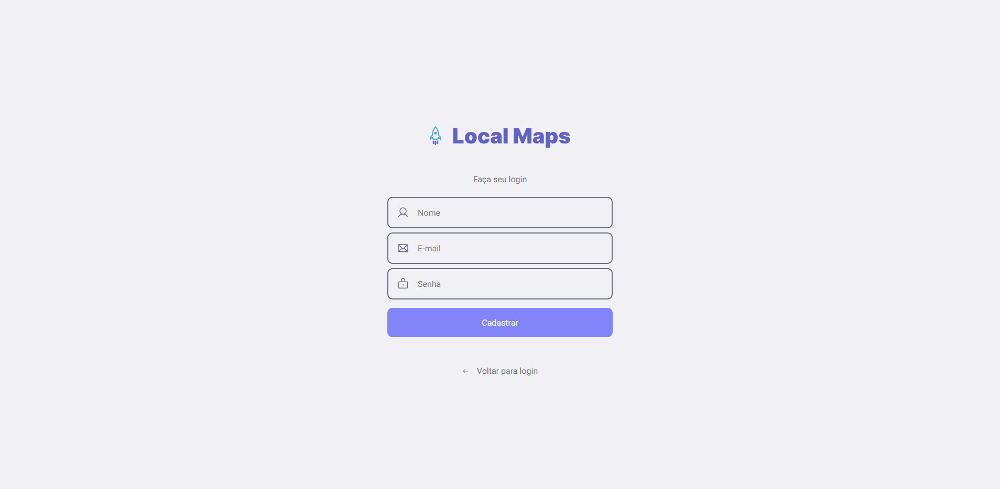
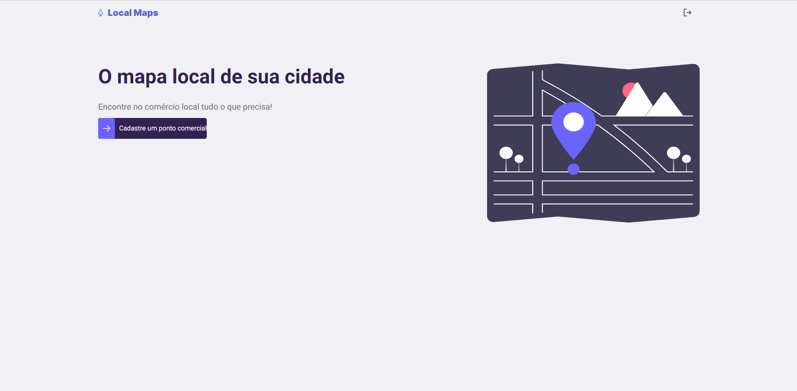
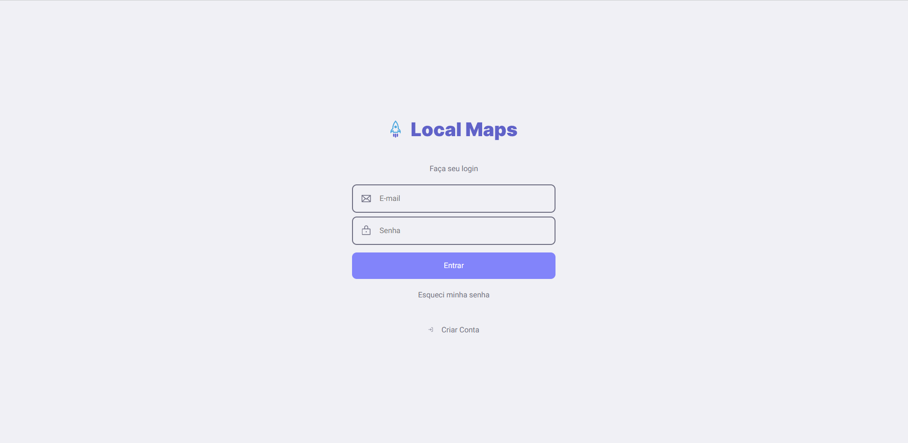

## Local-maps 🌎

### In Progress

### Sobre ✨

Local Maps é um app que ajuda as pessoas a conhecer melhor o comércio local, ou seja,
o projeto  é constituído por uma plataforma web que as pessoas possam cadastrar os estabelecimentos.

### Layout 🦚

### Web
<p aling="center">
  
  
  
</p>


### Mobile 
<p aling="center">
  
  
  
</p>


### 🚀 Tecnologias

#### Back-End

-  [Node.js](https://nodejs.org/en/)
-  [Express](https://expressjs.com/)
-  [Typescript](https://www.typescriptlang.org/)
-  [Prisma - ORM](https://www.prisma.io/)
-  [Bcrypt](https://www.npmjs.com/package/bcrypt)
-  [JWT](https://jwt.io/)
-  [Jest](https://jestjs.io)
-  [Celebrate](https://www.npmjs.com/package/celebrate)

#### Banco de dados

- [PostgresSql](https://www.postgresql.org/)
- [Docker](https://www.docker.com)

#### Front-End 

- [React.js](https://reactjs.org/docs/getting-started)
- [Typescript](https://www.typescriptlang.org/)
- [Styled Components](https://styled-components.com/)
- [Zod](https://zod.dev/)
- [React-use-form](https://react-hook-form.com/api/Useform/)

#### Mobile

-  [Typescript](https://www.typescriptlang.org/)
-  [React.js](https://reactjs.org/docs/getting-started)
-  [React-Native](https://reactnative.dev)
-  [Styled Components](https://styled-components.com/)
-  [Zod](https://zod.dev/)
-  [React-use-form](https://react-hook-form.com/api/Useform/)

<details open>
  <summary><h3>Arquitetura </h3></summary>
Para execução do projeto eu procurei utilizar Single Responsibility Principle (SRP), que basicamente consiste 
em modulos e funções deve ter uma responsabilidade.
  
</details>  


### Features In Progress
- [ ] Implemetar Testes unitários e integração Back-end; 🚧
- [ ] Implemetar Teste no Front-end; 🚧
- [ ] Fizalizar mobile; 🚧

### 📃 Regras de Négocio

- [x] Cadastrar um novo usuário;
- [x] Logar um usuário;
- [x] Verificar autenticação para rotas privadas;
- [x] Mostar detalhes do usuário;
- [x] Cadastrar um estabelecimento;
- [x] Listar um estabelecimento;

## ✅ Requisitos Back end

Para executar o projeto você precisa instalar as depedência citadas a cima 

```bash
# Entre na pasta back-end
$ cd back-end

# Execute o comando e o projeto sera aberto no Visual Studio Code
$ code .

# Instale as dependências
$ yarn dev

# Após isso você precisa gerar as tables no DB.

# Não se esqueça de configurar o DB em prisma/schema.prisma e
# também a variável DATABASE_URL e a JWT_SECRET_KEY no arquivo .env

# Após, basta rodar o comando abaixo.
$ npx prisma migrate dev --name init

# Inicialize o servidor em modo desenvolvimento
$ yarn run dev

# O servidor irá iniciar em http://localhost:3001
```

## ✅ Requisitos Front-end

Para executar o projeto você precisa instalar as depedência citadas a cima 

```bash
# Entre na pasta front end
$ cd front-end

# Execute o comando e o projeto sera aberto no Visual Studio Code
$ code .

# Instale as dependências
$ yarn dev

# Após isso você precisa gerar as tables no DB.

# Inicialize o servidor em modo desenvolvimento
$ yarn run dev

# O servidor irá iniciar em http://localhost:3333
```
